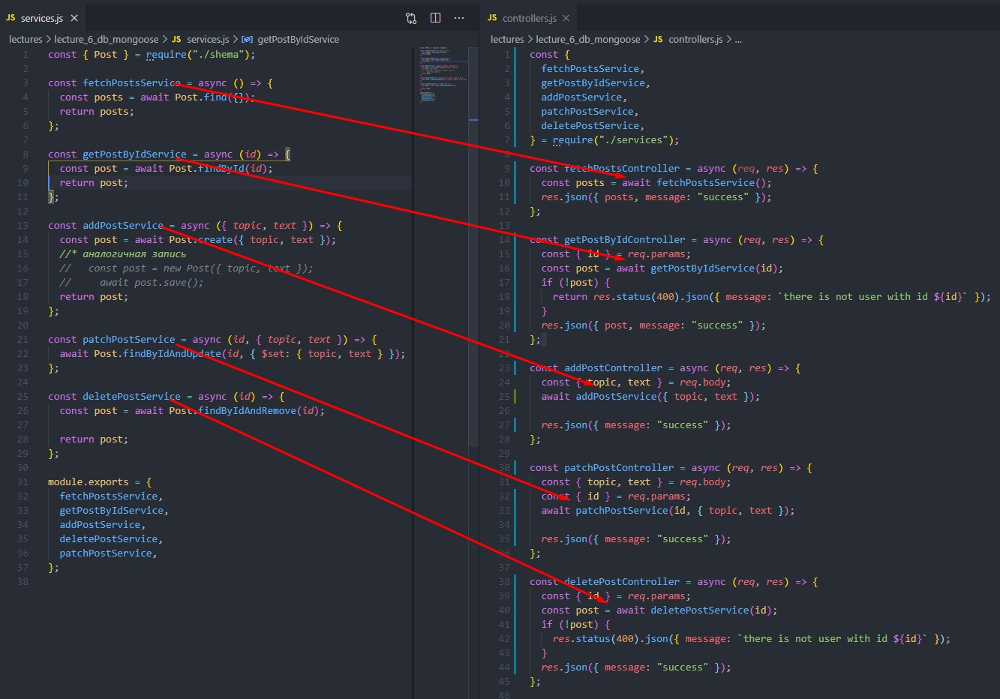
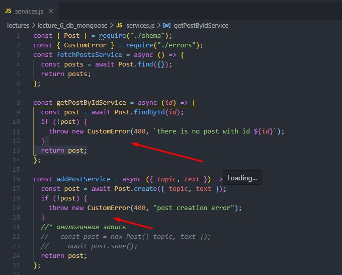
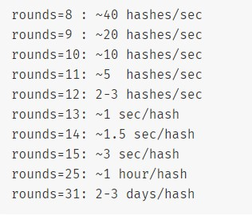
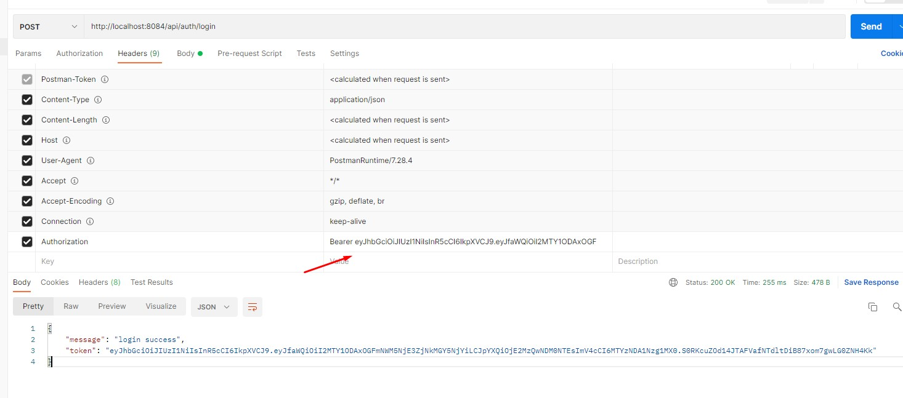

### Navigation:

- [Lecture-1](#lecture-1)

  - [Process](#process)
  - [Path](#path)
  - [fs - модуль для работы с файлами](#fs---модуль-для-работы-с-файлами)

- [Lecture-2: создание веб-сервера: нативный node js и express](#lecture-2-создание-веб-сервера-нативный-node-js-и-express)

  - [Practice](#practice)
  - [Создание веб-сервера на express (`npm i express`)](#создание-веб-сервера-на-express-npm-i-express)
  - [Middlweare](#middlweare)
  - [nodemon - пакет для автоматической подгрузки изменений без перезапуска сервера](#nodemon---пакет-для-автоматической-подгрузки-изменений-без-перезапуска-сервера)

- [Lecture-3](#lecture-3)

  - [Добавление маршрутов через books-router](#добавление-маршрутов-через-books-router)
  - [Использование библиотеки got (npm i got) для запросов на внешние API](#использование-библиотеки-got-npm-i-got-для-запросов-на-внешние-api)

- [Lecture-4](#lecture-4)
- [Валидация Joi (npm i joi)](<#Валидация-Joi-(npm-i-joi)>)
- [Refactoring](#refactoring)

---

- [CRUD](#CRUD)
- [Работа с базами данных](#работа-с-базами-данных)

---

- [MongoDB](#MongoDB)
- [Подключение к Mongo Compass](#Подключение-к-Mongo-Compass)
- [Работа с Mongo Compass](#Работа-с-Mongo-Compass)
- [Основные операции в MongoDB](#Основные-операции-в-MongoDB)

---

- [Подключение к БД в приложении](#Подключение-к-БД-в-приложении)

  ## [Практика](#практика)

- [Написание контроллеров](#Написание-контроллеров)
- [Обработка ошибок в контроллерах](#Обработка-ошибок-в-контроллерах)
- [Подключение к БД через mongoose](#Подключение-к-БД-через-mongoose)
- [Сервисы для сообщения с БД](#сервисы-для-сообщения-с-бд)

### Отлов ошибок

- [Кастомные ошибки](#кастомные-ошибки)
- [Цепочка отлова ошибок](#Цепочка-отлова-ошибок)

---

- [Аутентификация и авторизация](#аутентификация-и-авторизация)
- [Хеширование паролей](#Хеширование-паролей)
- [Bcrypt для адаптивного хеширования паролей](#Bcrypt-для-адаптивного-хеширования-паролей)

## Практика

---

- [Архитектура проекта](#архитектура-проекта)

- [Модель юзера](#Модель-юзера)
- [Сервисы юзера](#Сервисы-юзера)
- [Контроллеры юзера](#контроллеры-юзера)
- [Роутеры юзера](#роутеры-юзера)

- [Добавление логики для приватного доступа юзера к постам](#Добавление-логики-для-приватного-доступа-юзера-к-постам)
- [Рефакторинг контроллеров постов](#Рефакторинг-контроллеров-постов)

# Lecture-1

[Ссылка на код](./lecture_1.js)

## Process

`process.env` - переменные окружения
`process.argv` -список аргументво, с которыми запущено приложение
`process.exit` - для мгновенного завершения работы приложения
`__dirname` - путь к директории проекта
`__filename` - путь к файлу

## Path

`const path = require('path')` - подключение path-модуля
`path.resolve("путь к файлу")` - полный путь
`path.join("путь к файлу")` - относительный путь

## fs - модуль для работы с файлами

```
const fs = require("fs");
const path = require("path");

fs.readFile(path.resolve("./data.txt"), "utf8", (error, data) => {
if (error) {
console.error(error);
}
console.log(data);
});
```

**Чтобы не передавать коллбеки при чтении или записи файла, можно использовать модуль `fs` с промисами**:

```
const fs = require("fs/promises");
const path = require("path");

fs.readFile(path.resolve("./data.txt"), "utf8")
  .then(console.log)
  .catch(console.error);
```

Для удобства можно создать обертку с асинхронной функцией:

```
(async () => {
  const data = await fs.readFile(path.resolve("./data.txt"), "utf8");
  console.log(data);
})();

```

# Lecture-2: создание веб-сервера: нативный node js и express

[Ссылка на код](./lectures/lecture_2.js)

Запрос включает:

1. `Request line` - (Метод, адрес, версия протокола HTTP) - данные о запросе
2. `Header Fields` - (Method, User-Agent, Content-Type) - вспомогательные мета-данные
3. `Message-Body` - непосредственно передаваемые данные

Ответ включает:

1. `Status Line` - (версия протокола HTTP, код ответа) - данные об ответе
2. `Headers` (Method, Date)
3. `Body` - возвращаемые данные

`URL` - адрес сайта
`URL` - идентификатор сайта

## Practice

1. Создание http-сервера на встроенном модуле http node.js:

```
const http = require("http");
const PORT = 8081;
const requistHandler = (req, res) => {
  res.writeHaed(200, { "Content-type": "text/html" });
  res.end("<h1>Hello</h1>");
};

const server = http.createServer(requistHandler);

server.listen(8080, (err) => {
  if (err) {
    console.error("error at server launch", err);
  }
  console.log(`server works at port ${PORT}`);
});

```

## Создание веб-сервера на express (`npm i express`)

- Запросы в express обрабатываются последовательно сверху вниз

```
const express = require("express");
const app = express();
const PORT = 8081;

app.get("/home", (req, res) => {
  // *По умолчанию статус 200
  //   res.sendStatus(200);
  res.send("get request");
});

// * Post

app.post("/home", (req, res) => {
  //   res.sendStatus(200);
  res.send("post request");
});

// * Delete

app.delete("/home", (req, res) => {
  //   res.sendStatus(200);
  res.send("delete request");
});

//* All routes

app.use((req, res) => {
  //   res.sendStatus(200);
  res.send("middlware request");
});

app.listen(PORT, (err) => {
  if (err) {
    console.error("error at server launch", err);
  }
  console.log(`server works at port ${PORT}`);
});

// *Redirect

app.use((req, res) => {
  res.redirect("https://google.com");
});

// *response json
// *промежуточно перед парсингом можно добавить статус

app.use((req, res) => {
  res.stasus(500).json({ nodeJS: "awesome" });
});


```

## Middlweare

- `app.use(express.json())` - встроенный миддлвар для парсинга json
- `app.use(express.urlencoded({extended: true}))` - для данных из html-форм
- `app.use(express.static("folder/file"))` - для парсинга статических данных

```
// кастомный миддлвар для логирования запросов
// обязателен вызов next() для передачи управления
app.use((req, res, next) => {
  console.log(`${req.method} ${req.originalUrl}, ${new Date().toISOString()}`);
  next();
});
```

`npm i morgan` - внешний миддлвар для логирования запросов
`app.use(morgan("tiny"));`

## nodemon - пакет для автоматической подгрузки изменений без перезапуска сервера

- `npm i nodemon`
- В package.json прописать скрипт `"start:dev": "nodemon имя_файла.js"`

# Lecture-3

## Добавление маршрутов через books-router

1. Создать файл `booksRouter.js` и index.js
2. Код `booksRouter`:

```
const express = require("express");
const router = express.Router();

router.get("/books", (req, res) => {
  res.json({ books: [] });
})
// CRUD-операции можно чейнить в роутере
  .post("/books", (req, res) => {
    res.json({ books: 1 });
  });


module.exports = { router };
```

3. В (`index.js`)[#index-js]:

```
const express = require("express");
const app = express();
const PORT = 8081;
const morgan = require("morgan");

// Импортируем router //
const { router } = require("./booksRouter");

// добавляем приставку api, на случае расширения маршрутов в дальнейшем
app.use("/api", router);

app.use(express.json());
app.use(morgan("tiny"));

app.post("/home", (req, res) => {
  res.json({ javascript: "obj", body: req.body });
});

app.listen(PORT, (err) => {
  if (err) {
    console.error("error at server launch", err);
  }
  console.log(`server works at port ${PORT}`);
});

```

## Использование библиотеки got (npm i got) для запросов на внешние API

1. Создать папку `apiWeather` и файл `server.js`
2. Регистрация https://www.weatherbit.io/ - сервис для просмотра погоды
3. Копирование параметров: ключа и координат(lat, lon) для отправки запросов
4. В `server.js` прописать

```
const express = require("express");
const morgan = require("morgan");
const got = require("got");
const app = express();

app.use(express.json());
app.use(morgan("tiny"));

const PORT = 8085;
const BASE_URL = "http://api.weatherbit.io/v2.0/current";
const API_KEY = "05fd58cb68fb43519839efd8c821a972";

app.get("/api/weather", async (req, res) => {
  try {
    const response = await got(BASE_URL, {
      searchParams: {
        key: API_KEY,
        lat: "38.123",
        lon: "-78.543",
      },
    });
    res.json({ data: response.body });
    responseType: "json",

  } catch (error) {
    res.status(500).json({ message: error.message });
  }
});

app.listen(PORT, (err) => {
  if (err) {
    console.error("error at server launch", err);
  }
  console.log(`server works at port ${PORT}`);
});

```

### Деструктуризация для формирования ответа из выбранных полей:

```
 const [weatherData] = response.body.data;
    const {
      city_name,
      temp,
      weather: { description },
    } = weatherData;

    res.json({ data: { city_name, temp, description } });

```

### Динамическая передача параметров

```
const { latitude, langitude } = req.query;
const response = await got(BASE_URL, {
searchParams: {
key: API_KEY,
lat: latitude,
lon: langitude,
},

```


## Переменные окружения

Пароли, ключи и прочие секьюрные данные хранятся в переменных окружения файла `.env`. Для доступа к ним нужно:

1. Установить пакет `npm i dotenv`
2. Перенести данные в `.env`. На текущем этапе он включает:

```
PORT=8083
API_KEY=MY_API_KEY
```

3. В файле, где используются переменные окружения (server.js) заимпортировать `require("dotenv").config()`
4. Теперь PORT и KEY для доступа к API можно прописать так:

```
const PORT = process.env.PORT || 8081;
const KEY = process.env.API_KEY;
```

## Lecture-4

[Ссылка на код](./lectures/lecture_4)

1. Создать файлы `fullRestApi.js` и папку Routers с файлом `postsRouter.js`

Код для `fullRestApi.js`:

```
const express = require("express");
const morgan = require("morgan");
const app = express();

const { postsRouter } = require("./routers/postsRouter");

app.use(express.json());
app.use(morgan("tiny"));
require("dotenv").config();

const PORT = process.env.PORT || 8080;

app.use("/api/posts", postsRouter);

app.listen(PORT, (err) => {
  if (err) {
    console.error("error at server launch", err);
  }
  console.log(`server works at port ${PORT}`);
});

```

для [`postsRouter.js`](#fullRestApi):

```
const express = require("express");
const router = express.Router();
const posts = [
  { id: "1", topic: "test-1", text: "topic text-1" },
  { id: "2", topic: "test-2", text: "topic text-2" },
  { id: "3", topic: "test-3", text: "topic text-3" },
];

router.get("/", (req, res) => {
  res.json({ posts, status: "success" });
});

// *req.params.id
router.get("/:id", (req, res) => {
  const [post] = posts.filter((item) => item.id === req.params.id);
  res.json({ post, status: "success" });
});
router.post("/", (req, res) => {
  const { topic, text } = req.body;
  posts.push({
    id: new Date().getTime().toString(),
    topic,
    text,
  });
  res.json({ status: "success" });
});

router.put("/:id", (req, res) => {
  res.json({ posts: 1 });
});

router.delete("/:id", (req, res) => {
  res.json({ posts: 1 });
});

module.exports = { postsRouter: router };


```

Код для `fullRestApi.js`

```
const express = require("express");
const morgan = require("morgan");
const app = express();

const PORT = process.env.PORT || 8080;
const { postsRouter } = require("./routers/postsRouter");

app.use(express.json());
app.use(morgan("tiny"));
require("dotenv").config();

app.use("/api/posts", postsRouter);

app.listen(PORT, (err) => {
  if (err) {
    console.error("error at server launch", err);
  }
  console.log(`server works at port ${PORT}`);
});
```

# Валидация Joi (npm i joi)

Пример валидации на добавление поста:

```
  const shema = joi.object({
    topic: Joi.string().alphanum().min(3).max(30).required(),
    text: Joi.string().alphanum().min(5).max(300).required(),
  });

  const validationResult = shema.validate(req.body);
  if (validationResult.error) {
    return res.status(400).json({ message: validationResult.error.details });
  }
```

## Refactoring

### Вынос валидации в отдельный файл


### Вынос логики запросов в контроллеры


---

### CRUD

Основные операции:

- **GET** - для получения данных. При успешном запросе возвращает представление ресурса в формате JSON или XML и код состояния 200.

- **POST** - используется для отправки сущностей к определенному ресурсу. Создает новый ресурс, т.е. является не идемпотентным. Возвращает код состояния 201. Можно установить заголовок Location с указанием адреса создаваемого ресурса (если ресурс был перемещен)

- **PATCH** - частично обновляет ресурс.
- **PUT** - заменяет объект.
- **DELETE** - удаляет ресурс по _id_.

PUT заменяет ресурс текущим представлением запроса

DELETE удаляет указанный ресурс.

PATCH используется для частичного изменения ресурса

### Работа с базами данных

Виды базы данных:

1. Реляционные (SQL) - хранят данные в таблицах, которые связываются друг с другом. Ячейки информации в таблицах представлены колонками и строками. Нужно строго определять схему.
2. Нереляционные (NoSQL) - данные хранятся в виде иерархических структур с произвольным числом атрибутом. Нет строгих требований к схеме.

## MongoDB

MongoDB - документоориентированная noSQL база данных. Хранит данные в JSON-коллекциях.

### Регистрация

1. **Зарегистрироваться на** [официальном сайте](https://account.mongodb.com/account/register)

2. **Создать базу данных**


3. **Создать кластер**


4. **Добавить нового юзера**


5. **Добавить IP-адрес в разделе Network Access**


### Подключение к Mongo Compass

1. Установить [Mongo Compass](https://www.mongodb.com/try/download/compass) - графический интерфейс
2. Перейти в раздел DataBase, кликнуть на connect и выбрать MongoDB Compass


3. Скопировать строку, заменив `<password>` на свой пароль


4. Вставить строку в Mongo Atlas и подключиться.


### Работа с Mongo Compass

1. Создать БД и коллекцию (отобразится в интерфейса)


2. Для операций с коллекциями можно использовать графический интерфейс (вверху) или консоль (внизу).


### Основные операции в MongoDB

Далее будем использовать консоль.

- `show dbs` - выведет все БД
- `use <name>` - перейдет на БД с указанным name
- `show collections` - выведет все коллекции БД
- `db.createCollection('nameCollection')` - создаст новую коллекцию
- `db.nameCollection.insert({key:value})` - добавляет новый документ в коллекцию
- `db.nameCollection.find({})` - выведет все документы в коллекции
- `db.nameCollection.findOne({key: value})` - выведет конкретный документ
- `db.nameCollection.updateOne({key:value}, {$set: {key:newValue}})` - обновит конкретное поле (если не указать `$set`, обновит весь документ, а неуказанные поля затрутся)
- `db.nameCollection.remove({key:value})` - удалит документ из коллекции по полю // `deleteOne` - делает то же самое
- `db.nameCollection.deleteOne({_id: ObjectId(<id>)})` - удаление по id

### Подключение к БД в приложении

Первым делом нужно:

1. Установить нативный драйвер mongoDB `npm i mongodb`
2. Сделать импорт в файле с подключением сервера `const mongoClient = require("mongodb").MongoClient;`
3. В Mongo Atlas перейти в `connect > connect your application` и скопировать url-адрес


4. Добавить url в .env и заменить `<password>` на свой пароль
5. Указать вместо myFirstDataBase название своей БД

`MONGO_URL=mongodb+srv://alex:<password>@newcluster.uoqvl.mongodb.net/myFirstDatabase?retryWrites=true&w=majority`

Код примера с комментариями:

```
const express = require("express"); //* каркас для построения приложения
const app = express(); //* вызывает функцию из express
const morgan = require("morgan"); //* для логирования запросов
const MongoClient = require("mongodb").MongoClient; //* модуль для подключения к MongoDB
require("dotenv").config(); //* для доступа к переменным окружения в .env

const PORT = process.env.PORT || 8080;

//* Мидлвары
app.use(express.json()); // *мидлвар для парсинга json
app.use(morgan("combined")); //* вызов мидлвар для логирования

//* IIFE для подключения к серверу
(async () => {
  //* настройки подключения
  const client = await MongoClient.connect(process.env.MONGO_URL, {
    useNewUrlParser: true, //* указывает использовать последнюю версию синтаксического анализатора (парсера url-строки)
    useUnifiedTopology: true, //* указывает использовать последнюю версию механизма обнаружения и мониторинга серверов
  });
  const db = client.db(); //* модуль для обращения к коллекциям в БД, db(<здесь>) можно указать имя БД или в .env

  const Users = db.collection("users"); //* создает коллекцию users
  const users = await Users.find({}).toArray(); //* база данных возвращает coursor, нужно преобразовать его в массив
  console.log(users); //* здесь будет коллекция

  //* если не передать порт, сгенерируется случайный
  app.listen(PORT, (err) => {
    if (err) {
      console.error("error at server launch", err);
    }
    console.log(`server works at port ${PORT}`);
  });
})();
```

### Практика

Для обеспечения удобного пользования сразу же позаботимся об архитектуре приложения. Оно будет включать:

- [server.js](./lectures/letcure_5_db/RestFulDb/server.js) для создания сервера через express
- [connection.js](./lectures/letcure_5_db/RestFulDb/connection.js) для подключения к БД
- [controllers.js](./lectures/letcure_5_db/RestFulDb/controllers.js) - для обработки логики запросов
- [routers.js](./lectures/letcure_5_db/RestFulDb/routers.js) - для создания маршрутов на **GET**, **POST** и др. запросы.
- [middlwareModels.js](./lectures/letcure_5_db/RestFulDb/middlewareModels.js) - для получения коллекции из БД во внешнем коде

Функция подключения к БД вызывается в [IIFE](https://developer.mozilla.org/ru/docs/Glossary/IIFE) перед созданием сервера:


Стоит заострить внимание на том, как организован доступ к коллекции. По порядку о связи между файлами:

- из `connection.js` (_слева вверху_) возвращаются функции `connectMongo` и `getCollections`
- `connectMongo` вызывается в `server.js` (_слева внизу_) перед `listen()`, т.е перед запуском сервера
- `getCollections` передается в `middlwareModels.js` (_справа вверху_), где записывается в переменную `collections`, которая записывается в запросе в переменную db - `req.db`.
- из `middlwareModels.js` в `routers.js`(_справа внизу_) передается миддлвар и вызывается для всех маршрутов (`router.use(middlwareModels)`)


Теперь на `req.db` в контроллерах можно получить созданную коллекцию.

### Написание контроллеров

После записи коллекции через миддлвар она доступна во всем приложении на req.db.Posts Поэтому в [controllers.js](./lectures/letcure_5_db/RestFulDb/controllers.js) можно приступить к написанию операций.

1. **Получение всех постов:**

```
const fetchPosts = async (req, res) => {
  const posts = await req.db.Posts.find({}).toArray();
  res.json({ posts, status: "success" });
};
```

2. **Получение одного поста по id:**

```
// ObjectId понадобится, чтобы преобразовать строку к объекту _id MongoDB
const { ObjectId } = require("mongodb");

const getPostById = async (req, res) => {
  const post = await req.db.Posts.findOne({ _id: new ObjectId(req.params.id) });
  if (!post) {
    return res.status(400).json({
      status: `failure, no posts with id ${id} found`,
    });
  }
  res.json({ post, status: "success" });
};


```

3. **Добавление поста:**

```
const addPost = async (req, res) => {
  const { topic, text } = req.body;
  await req.db.Posts.insertOne({ topic, text });

  res.json({ status: "success" });
};
```

4. **Обновление поста:**

```
const patchPost = async (req, res) => {
  await Posts.updateOne(
    { _id: new ObjectId(req.params.id) },
    { $set: { topic, text } }
  );
  res.json({ status: "success" });
};

```

5. **Удаление поста**

```
const deletePost = async (req, res) => {
  await req.db.Posts.deleteOne({ _id: new ObjectId(req.params.id) });

  res.json({ status: "success" });
};

```

### Обработка ошибок в контроллерах

Выше прописаны CRUD операции, но в них не обрабатываются ошибки. Можно прописать `try/catch` для каждого контроллера, но чтобы не дублировать код, лучше написать миддлвар, который будет заниматься отловом ошибок. Для этого в server.js понадобится миддлвар с 4-мя параметрами:

```
app.use((error, req, res, next) => {
  res.status(500).json({ message: error.message });
});

```

Также потребуется промежуточное ПО в [routers.js](./lectures/letcure_5_db/RestFulDb/routers.js). Т.к. это ПО не относится к маршрутизации, его стоит вынести в отдельный файл. Например, [asyncWrapper.js](./lectures/letcure_5_db/RestFulDb/asyncWrapper.js)

```
const asyncWrapper = (controller) => {  // принимает контроллер
   return (req, res, next) => { // возвращает миддлвар, где контроллер принимает req и res
    controller(req, res).catch(next); // в случае ошибки catch отлавливает ее и передает в обработчик ошибок в server.js
  };
};
module.exports = { asyncWrapper };

```

Теперь в [routers.js](./lectures/letcure_5_db/RestFulDb/routers.js) можно обернуть все контроллеры в `asyncWrapper`, и можно не писать `try/catch` для контроллеров:

```
const { asyncWrapper } = require("./asyncWrapper");

router.get("/", asyncWrapper(fetchPosts));
router.get("/:id", asyncWrapper(getPostById));
router.post("/", asyncWrapper(addPostValidation), addPost);
router.patch("/:id", asyncWrapper(patchPost));
router.delete("/:id", asyncWrapper(deletePost));
```

### Подключение к БД через mongoose

Mongoose - это драйвер для MongoDB которые существенно упрощает сообщение с БД и управление коллекциями за счет новых методов, а также возможность создавать четкие схемы. Для работы нужен пакет `npm i mongoose`.

Теперь изменим код для постов так, чтобы использовать ~~не нативный драйвер~~, а `mongoose`.

Архитектура приложения почти такая же, как и при использовании нативного драйвера:

- [server.js](./lectures/lecture_6_db_mongoose/server.js) для создания сервера через express
- [routers.js](./lectures/letcure_5_db/RestFulDb/routers.js) - для создания маршрутов на **GET**, **POST** и др. запросы.
- [controllers.js](./lectures/lecture_6_db_mongoose/controllers.js) - для обработки логики запросов
- [connection.js](./lectures/) для подключения к БД
- [middlwareModels.js](./lectures/letcure_5_db/RestFulDb/middlewareModels.js) - для получения коллекции из БД во внешнем коде
- [apiHelpers.js](./lectures/lecture_6_db_mongoose/apiHelpers.js) - создание миддлваров для отлова ошибок

- [connect.js](./lectures/lecture_6_db_mongoose/connect.js) - подключение к БД
- [shema.js](./lectures/lecture_6_db_mongoose/shema.js) - описывает схему коллекции

Почти все модули имеют прежнюю. Файл [middlwareModels.js](./lectures/letcure_5_db/RestFulDb/middlewareModels.js) больше не нужен. И его вызов также нужно убрать из [routers.js](./lectures/letcure_5_db/RestFulDb/routers.js)

~~router.use(middlwareModels);~~

Основные изменения коснулись файлов `connect.js` и `сontrollers.js`. Также добавился файл `shema.js`.

1. Подключение к БД в `connect-js` стало локаничнее. Слева - нативный драйвер; справа - ODB mongoose:


2. После настройки подключения нужно определить схему коллекции в [shema.js](./lectures/lecture_6_db_mongoose/shema.js):

```
const mongoose = require("mongoose");
const { Schema } = mongoose;

const postShema = new Schema(
  {
    topic: {
      type: String,
      minlength: 3,
      maxlength: 30,
      required: [true, "Topic is required"],
      unique: true,
    },
    text: {
      type: String,
      required: [true, "Text is required"],
    },
  },
  //* versionKey: false отключает версионирование (поле _v)
  //* timestamps: true добавляет в схему поля createdAt и updateAt
  { versionKey: false, timestamps: true }
);

// * После создания схемы ее нужно скомпилировать в модель

const Post = mongoose.model("Post", postShema);

module.exports = { Post };
;
```

[Ссылка на раздел документации по составлению схем](https://mongoosejs.com/docs/guide.html)

3. Теперь можно заимпортировать коллекцию в [controllers.js](./lectures/lecture_6_db_mongoose/controllers.js) и можно использовать ее для операций с коллекцией:

```
const { Post } = require("./shema");

// получение всех постов
const fetchPosts = async (req, res) => {
  const posts = await Posts.find({}); //* преобразовывать в массив не нужно, mongoose сделает это сам
  res.json({ posts, status: "success" });
};

// получение поста по id
const getPostById = async (req, res) => {
  const post = await Post.findById(req.params.id);
  res.json({ post, status: "success" });
};


// добавление поста
const addPost = async (req, res) => {
  const { topic, text } = req.body;

  await Post.create({ topic, text });

  //* аналогичная запись
  //   const post = new Post({ topic, text });
  //     await post.save();
  res.json({ status: "success" });
};

// обновление поста
const patchPost = async (req, res) => {
  const { topic, text } = req.body;
  await Post.findByIdAndUpdate(req.params.id, { $set: { topic, text } });
  res.json({ status: "success" });
};

// удаление поста


```

### Сервисы для сообщения с БД

Контроллеры должны формировать ответ для отправки клиенту. Бизнес логика же и, в частности, операции по связи с БД - это сервисы. Поэтому для них нужно создать соответствующий модуль.

В файл [services.js](./lectures/lecture_6_db_mongoose/services.js) переезжает часть логики из [controllers.js](./lectures/lecture_6_db_mongoose/controllers.js):



### Кастомные ошибки

[Ранее был пример с миддлваров](#Обработка-ошибок-в-контроллерах), который оборачивает контроллеры и отлавливает ошибки в них.

В [apiHelpers.js](./lectures/lecture_6_db_mongoose/apiHelpers.js) есть миддлвар, который передается в [routers.js](./lectures/lecture_6_db_mongoose/routers.js) и обрабатывает ошибки в контроллерах.

```
const asyncWrapper = (controller) => {
  return (req, res, next) => {
    controller(req, res).catch(next);
};

module.exports = { asyncWrapper };

```

Сюда же поместим логику для миддлвара с 4-мя параметрами из `servise.js`, а там будем просто вызывать функцию через `app.use()`

```
// в apiHelpers.js
const errorHandler = (error, req, res, next) => {
  res.status(500).json({ message: error.message });
};

// в server.js
app.use(errorHandler);

```

Сейчас миддлвар errorHandler в [apiHelpers.js]('./../lectures/lecture_6_db_mongoose/apiHelpers.js'), который, в конечном итоге, отлавливает все ошибки, всегда возвращает 500 код ответа:

```
const errorHandler = (error, req, res, next) => {
  res.status(500).json({ message: error.message });
};
```

Чтобы отлавливать переданные в экземплярах класса ошибки, нужно добавить проверку:

```
const errorHandler = (error, req, res, next) => {
  if (error instanceof CustomErr) {
    return res.status(error.status).json({ message: error.message });
  }
  res.status(500).json({ message: error.message });
};
```

Для оптимизиации обработки ошибок можно создать файл `errors.js` и добавить класс:

```
//* обработка ошибок валидации
class CustomError extends Error {
  constructor(status, message) {
    super(message);
    this.status = status;
    this.message = message;
  }
}

```

Теперь при обработке ошибок можно создавать экземпляры класса CustomError, передавая 1-м параметром нужный статус, а 2-м - сообщение.

На примере [validationMiddlware.js](./lectures/lecture_6_db_mongoose/validationMiddlware.js) вот как можно обработать ошибки валидации:

```
    const { CustomError } = require("./errors");

    const validationResult = shema.validate(req.body);
    if (validationResult.error) {
      next(
        new CustomError(
          400,
          validationResult.error.details[0].message.replace(/"/g, "")
        )
      );
    }
    next();
  },
};
```

Этот же класс, например, можно использовать для обработки ошибок в [services.js](./lectures/lecture_6_db_mongoose/services.js):



### Цепочка отлова ошибок

Допустим, при добавлении поста по `id` в `getPostByIdService` случается ошибка. Тогда произойдет следующее:

1. Сработает инструкция `throw new CustomError(400, "there is no post with entered id");` и ошибка пробросится дальше, то есть в `controllers.js`
2. Контроллер получит ошибку и передаст ее в `routers.js`
3. В `routers.js`сработает инструкция `router.post("/", addPostValidation, asyncWrapper(addPostController));`. Прослойка `asyncWrapper` в [apiHelpers.js](./lectures/lecture_6_db_mongoose/apiHelpers.js) перехватит управление перед вызовом `addPostController`.
4. Далее через `next()` миддлвар `asyncWrapper` передаст ошибку в `ErrorHandler`, так как именно он вызывается как главный миддлвар для отлова ошибок в `server.js` - `app.use(errorHandler);`

---

### Аутентификация и авторизация

Аутентификация направлена на то, чтобы идентифицировать пользователя. Т.е. она происходит при логинизации. Авторизация же нацелена на то, чтобы определить его права. Например, права обычного юзера и админа отличаются, и за это отвечает авторизация, которая происходит после аутентификации.

Есть несколько видов аутентификации:

1. Basic - данные о зарегистрированном или авторизованном пользователе передаются в заголовке авторизации в формате `Authorization: Basic base64_encode(login:password)`.

2. JSON Web Token (JWT) - при аутентификации подписывается токен, состоящий из заголовка (`header`), полезной нагрузки (`paylaod`), куда записываются данные, по которым можно идентифицировать юзера (чаще всего id) и подпись (`signature`)

3. OAuth - для регистрации через аккаунт в google, facebook и др. популярные сервисы.

### Хеширование паролей

Важнейший атрибут секьюрного сервиса - защита приватных данных пользователей. Хеширование дает возможность повысить безопасность путем шифрования паролей, т.к. именно они используются для доступа к закрытым аккаунтам. Хеширование происходит таким образом:

1. При регистрации пользователь вводит пароль и он отправляется на бекенд
2. К строке пароля добавляется _соль_(`salt`), представляющая собой опрределенную строку. Добавление _соли_ гарантирует повышенную безопасность, но все еще не спасает от атак перебором.
3. На бекенде происходит хеширование. В хеше, помимо пароля, хранится `SECRET_KEY`, поэтому расшифровать уже сложнее, но все еще не идеально.

### Bcrypt для адаптивного хеширования паролей

Выше описани механизм статического хеширования, но он недостаточно безопасен, т.к. не гарантирует защиту от атак перебором.

Для решения этой проблемы был изобретен адаптивный алгоритм хеширования паролей - `bcrypt`. Подробнее почитать об этом механизме можно [по ссылке](https://codahale.com/how-to-safely-store-a-password/), но суть в том, что он хеширует пароль, после хеширует хеш и так указанное число раундов. Это повышает защиту _Brute force_ атак на несколько порядков.

[В документации](https://www.npmjs.com/package/bcrypt) есть таблица с временем хеширования для процессора 2GHz при различном количестве раундов:



Установка пакета - `npm i bcrypt`. Позже он понадобится.

### Архитектура проекта

Для построения масштабируемого приложения важно заранее позаботиться о структуре. Это приложение будет включать цикл CRUD-операций, аутентификацию и авторизацию пользователя.

Корневая папка проекта `src`. В ней находится файл [server.js](./src/server.js), который запускает сервер. Также есть такие папки:

- `routes` - содержит [postRouters.js](./src/routes/postRouters.js) с маршрутами для постов и [authRouters](./src/routes/authRouters.js) с маршрутами для регистрации и логинизации.
- `middlwares` - содержит [validationMiddlware.js](./src/middlwares/validationMiddlware.js) с миддлваром для валидации
- `helpers` - содержит [errors.js](./src/helpers/errors.js) - фабрику для генерации кастомных ошибок, [apiHelpers.js](./src/helpers/apiHelpers.js) с обработчиками ошибок и [constants.js](./src/helpers/constants.js) с константами для кодов ошибок.

- `db` - содержит [connect js](./src/db/connect.js) с подключением к БД и [shema.js](src/db/shema.js) с описанием моделей

- `services` -
- `controllers` - содержит [postControllers.js](./src/controllers/postControllers.js) и [authControllers.js](./src/controllers/authControllers.js) для обработки запросов с маршрутами для постов и авторизацией юзера соответственно.

### Модель юзера

Данные будут храниться в базе данных, поэтому в [shema.js](./src/db/shema.js) создается модель пользователя. Здесь же нужно позаботиться о хешировании паролей с пакетом `npm i bcrypt`, о котором [говорилось в части о хешировании паролей](#Bcrypt-для-адаптивного-хеширования-паролей)). Для этого потребуется миддлвар mongoose.

```
const mongoose = require("mongoose");
const { Schema } = mongoose;
const bcrypt = require("bcrypt"); //* подключение bcrypt

const userShema = new Schema(
  {
    email: {
      type: String,
      minlength: 5,
      maxlength: 20,
      required: [true, "Name is required"],
      unique: true,
    },

    password: {
      type: String,
      required: [true, "Password is required"],
    },
  },
  { versionKey: false, timestamps: true }
);

//* здесь происходит хеширование паролей
userShema.pre("save", async function () {

//* если документ новый, хеширует пароль
  if (this.isNew) {
    this.password = await bcrypt.hash(this.password, 10);
  }
});

const User = mongoose.model("User", userShema);

module.exports = { User };
```

### Сервисы юзера

Импортируем схему юзера в сервисы и пропишем логику для регистрации и логина. Также потребуется пакет `npm i jsonwebtoken` для аутентификации по токену, о чем говорилось в разделе [аутентификация и авторизация](#Аутентификация-и-авторизация)

```
const bcrypt = require("bcrypt"); //* подключает bcrypt
const jwt = require("jsonwebtoken"); //* подключает jwt

const JWT_SECRET = process.env.SECRET; //* достает секрет из .env
const { User } = require("../db/userShema"); //* достает схему юзера

const { CustomError } = require("../helpers/errors");

const regService = async (email, password) => {
  // *создает нового юзера со свойствами email и password
  const user = new User({ email, password });
  await user.save(); //* сохраняет юзера в БД
};

const logService = async (email, password) => {
  const user = await User.findOne({ email });

  //* если не находит юзера в БД, пробрасывает ошибку авторизации
  if (!user) {
    throw new CustomError(401, `user with email "${email}" not exist`);
  }

  //* если введенный и полученный из БД пароль юзера не совпадаетт - ошибка
  //* password - пароль, который вводит юзер; user.password - пароль, который хранится на бекенде
  if (!(await bcrypt.compare(password, user.password))) {
    throw new CustomError(401, "wrong password");
  }

  //* если юзер найден - подписывает ему токен, записывая в payload его _id
  const token = jwt.sign(
    {
      _id: user._id, //* зашивает в token _id юзера
    },
    JWT_SECRET, //* 2-м аргументом ф-я sign принимает ключ
    { expiresIn: "4h" } //* здесь можно указать срок действия токена
  );
  return token; //* возвращает токен
};

module.exports = { regService, logService };


```

### Контроллеры юзера

Контроллеры импортируют логику сервисов и формируют ответы на клиент:

```
const { regService, logService } = require("../services/authService");

const regController = async (req, res) => {
  const { email, password } = req.body;
  await regService(email, password);
  res.json({ message: "registration success" });
};

const logController = async (req, res) => {
  const { email, password } = req.body;

  //* сервис возвращает токен, который можно записать в переменную, вызывав функцию
  const token = await logService(email, password);
  res.json({ message: "login success", token }); //* возвращаем токен клиенту как paylaod
};

module.exports = { regController, logController };
```

### Роутеры юзера

Логика контроллеров передается в [authRouters.js](./src/routes/authRouters.js). Нужно два маршрута: на регистрацию и на логин:

```
const express = require("express");
const router = express.Router();
const {
  regController,
  logController,
} = require("../controllers/authControllers");

const { asyncWrapper } = require("../helpers/apiHelpers");

router.post("/registration", asyncWrapper(regController));
router.post("/login", asyncWrapper(logController));

module.exports = { authRouter: router };

```

Подробнее о том, как использовать токен для авторизации пользователя на клиенте [можно почитать в другом конспекте](https://github.com/js-full-stack/react-redux-tutorial#%D0%97%D0%B0%D0%BF%D0%B8%D1%81%D1%8C-%D1%82%D0%BE%D0%BA%D0%B5%D0%BD%D0%B0-%D0%B2-%D0%B7%D0%B0%D0%B3%D0%BE%D0%BB%D0%BE%D0%B2%D0%BE%D0%BA-%D0%B0%D0%B2%D1%82%D0%BE%D1%80%D0%B8%D0%B7%D0%B0%D1%86%D0%B8%D0%B8)



### Добавление логики для приватного доступа юзера к постам

[Ранее был пример с добавлением операций для постов](#Написание-контроллеров). Но в такой имплементации посты доступны любому пользователю, а нужно сделать так, чтобы каждый юзер получал личную коллекцию постов из БД после авторизации. Для этого потребуется переписать [сервисы](./lectures/lecture_6_db_mongoose/services.js) и [контроллеры](./lectures/lecture_6_db_mongoose/controllers.js). Но cначала нужно добавить новое поле в [postShema.js](./src/db/postShema.js). Это поле будет идентифицировать юзера при манипулации коллекцией постов:

```
    userId: {
      type: String,
      required: true
    }
```

и написать миддлвар `authMiddlware.js`, с помощью которого будет происходить проверка токена:

```
const authMiddlware = (req, res, next) => {
  //* сплитим tokenType (Bearer) и token по пустой строке, деструктуризируя из в переменные
  const [tokenType, token] = req.headers.authorization?.split(" ");

  //* если токена нет - пробрасываем ошибку авторизации
  if (!token) {
    next(new CustomError(401, "Please, provide a token"));
  }
  try {
    //* если токен есть, декодируем его, передавая в функцию decode токен и секрет
    const user = jwt.decode(token, process.env.SECRET); //* декодируем токен и получаем payload юзера (id)
    req.token = token; //* записывает на request token (это необязательно)
    req.user = user; //* записываем на request декодированные данные юзера
    next(); //* передаем управление дальше
  } catch (error) {
    next(new CustomError(401, "Invalid token"));
  }
};

module.exports = { authMiddlware };

```

Теперь этот миддлвар нужно применить в [postRouters.js](./src/routes/postRouters.js): `router.use(authMiddlware)`. То есть теперь на `req.user` можно получить `id` зарегистрированного юзера и использовать его для авторизации при работе с коллекцией постов.

### Рефакторинг контроллеров постов

Для примера без авторизации цепочка методов для получения постов выглядит так:

```
// service
const fetchPostsService = async () => {
  const posts = await Post.find({});
  return posts;
};

// controller
const fetchPostsController = async (req, res) => {
  const posts = await fetchPostsService();
  res.json({ posts, message: "success" });
};

```

С авторизацией:

```
// service
const fetchPostsService = async (userId) => {
  //* находим посты пользователя поле userId которого === переданному
  const posts = await Post.find({ userId });
  return posts;
};

//controller
const fetchPostsController = async (req, res) => {
  //* достаем _id пользователя из миддлвара и переименовываем на userId
  const { _id: userId } = req.user;

  //* получаем посты юзера с переданным userId
  const posts = await fetchPostsService(userId);

  res.json({ posts, message: "success" });
};
```

Добавление без авторизации:

```
// service
const addPostService = async ({ topic, text }) => {
  const post = new Post({ topic, text });

//controller
const addPostController = async (req, res) => {
  const { _id: userId } = req.user;

  const { topic, text } = req.body;
  await addPostService({ topic, text });

  res.json({ message: "success" });
};

```

С авторизацией:

```
// service
const addPostService = async ({ topic, text }, userId) => {
  const post = new Post({ topic, text, userId });

  if (!post) {
    throw new CustomError(400, "post creation error");
  }
  await post.save();
  return post;
};


//controller

const addPostController = async (req, res) => {
  const { _id: userId } = req.user;

  const { topic, text } = req.body;
  await addPostService({ topic, text }, userId);

  res.json({ message: "success" });
};

```

Полный список операций для постов с авторизацией по ссылкам:

- [postService.js](./src/services/postServices.js)
- [postControllers.js](./src/controllers/postControllers.js)
