### Navigation:

- [Lecture-1](#lecture-1)

  - [Process](#process)
  - [Path](#path)
  - [fs - модуль для работы с файлами](#fs---модуль-для-работы-с-файлами)

- [Lecture-2: создание веб-сервера: нативный node js и express](#lecture-2-создание-веб-сервера-нативный-node-js-и-express)

  - [Practice](#practice)
  - [Создание веб-сервера на express (`npm i express`)](#создание-веб-сервера-на-express-npm-i-express)
  - [Middlweare](#middlweare)
  - [nodemon - пакет для автоматической подгрузки изменений без перезапуска сервера](#nodemon---пакет-для-автоматической-подгрузки-изменений-без-перезапуска-сервера)

- [Lecture-3](#lecture-3)

  - [Добавление маршрутов через books-router](#добавление-маршрутов-через-books-router)
  - [Использование библиотеки got (npm i got) для запросов на внешние API](#использование-библиотеки-got-npm-i-got-для-запросов-на-внешние-api)

- [Lecture-4](#lecture-4)
- [Валидация Joi (npm i joi)](<#Валидация-Joi-(npm-i-joi)>)
- [Refactoring](#refactoring)

---

- [CRUD](#CRUD)
- [Работа с базами данных](#работа-с-базами-данных)

---

- [MongoDB](#MongoDB)
- [Подключение к Mongo Compass](#Подключение-к-Mongo-Compass)
- [Работа с Mongo Compass](#Работа-с-Mongo-Compass)
- [Основные операции в MongoDB](#Основные-операции-в-MongoDB)

---

- [Подключение к БД в приложении](#Подключение-к-БД-в-приложении)
- [Практика](#Практика)
- [Написание контроллеров](#Написание-контроллеров)
- [Обработка ошибок в контроллерах](#Обработка-ошибок-в-контроллерах)

---

- [Подключение к БД через mongoose](#Подключение-к-БД-через-mongoose)

# Lecture-1

[Ссылка на код](./lecture_1.js)

## Process

`process.env` - переменные окружения
`process.argv` -список аргументво, с которыми запущено приложение
`process.exit` - для мгновенного завершения работы приложения
`__dirname` - путь к директории проекта
`__filename` - путь к файлу

## Path

`const path = require('path')` - подключение path-модуля
`path.resolve("путь к файлу")` - полный путь
`path.join("путь к файлу")` - относительный путь

## fs - модуль для работы с файлами

```
const fs = require("fs");
const path = require("path");

fs.readFile(path.resolve("./data.txt"), "utf8", (error, data) => {
if (error) {
console.error(error);
}
console.log(data);
});
```

**Чтобы не передавать коллбеки при чтении или записи файла, можно использовать модуль `fs` с промисами**:

```
const fs = require("fs/promises");
const path = require("path");

fs.readFile(path.resolve("./data.txt"), "utf8")
  .then(console.log)
  .catch(console.error);
```

Для удобства можно создать обертку с асинхронной функцией:

```
(async () => {
  const data = await fs.readFile(path.resolve("./data.txt"), "utf8");
  console.log(data);
})();

```

# Lecture-2: создание веб-сервера: нативный node js и express

[Ссылка на код](./lectures/lecture_2.js)

Запрос включает:

1. `Request line` - (Метод, адрес, версия протокола HTTP) - данные о запросе
2. `Header Fields` - (Method, User-Agent, Content-Type) - вспомогательные мета-данные
3. `Message-Body` - непосредственно передаваемые данные

Ответ включает:

1. `Status Line` - (версия протокола HTTP, код ответа) - данные об ответе
2. `Headers` (Method, Date)
3. `Body` - возвращаемые данные

`URL` - адрес сайта
`URL` - идентификатор сайта

## Practice

1. Создание http-сервера на встроенном модуле http node.js:

```
const http = require("http");
const PORT = 8081;
const requistHandler = (req, res) => {
  res.writeHaed(200, { "Content-type": "text/html" });
  res.end("<h1>Hello</h1>");
};

const server = http.createServer(requistHandler);

server.listen(8080, (err) => {
  if (err) {
    console.error("error at server launch", err);
  }
  console.log(`server works at port ${PORT}`);
});

```

## Создание веб-сервера на express (`npm i express`)

- Запросы в express обрабатываются последовательно сверху вниз

```
const express = require("express");
const app = express();
const PORT = 8081;

app.get("/home", (req, res) => {
  // *По умолчанию статус 200
  //   res.sendStatus(200);
  res.send("get request");
});

// * Post

app.post("/home", (req, res) => {
  //   res.sendStatus(200);
  res.send("post request");
});

// * Delete

app.delete("/home", (req, res) => {
  //   res.sendStatus(200);
  res.send("delete request");
});

//* All routes

app.use((req, res) => {
  //   res.sendStatus(200);
  res.send("middlware request");
});

app.listen(PORT, (err) => {
  if (err) {
    console.error("error at server launch", err);
  }
  console.log(`server works at port ${PORT}`);
});

// *Redirect

app.use((req, res) => {
  res.redirect("https://google.com");
});

// *response json
// *промежуточно перед парсингом можно добавить статус

app.use((req, res) => {
  res.stasus(500).json({ nodeJS: "awesome" });
});


```

## Middlweare

- `app.use(express.json())` - встроенный миддлвар для парсинга json
- `app.use(express.urlencoded({extended: true}))` - для данных из html-форм
- `app.use(express.static("folder/file"))` - для парсинга статических данных

```
// кастомный миддлвар для логирования запросов
// обязателен вызов next() для передачи управления
app.use((req, res, next) => {
  console.log(`${req.method} ${req.originalUrl}, ${new Date().toISOString()}`);
  next();
});
```

`npm i morgan` - внешний миддлвар для логирования запросов
`app.use(morgan("tiny"));`

## nodemon - пакет для автоматической подгрузки изменений без перезапуска сервера

- `npm i nodemon`
- В package.json прописать скрипт `"start:dev": "nodemon имя_файла.js"`

# Lecture-3

## Добавление маршрутов через books-router

1. Создать файл `booksRouter.js` и index.js
2. Код `booksRouter`:

```
const express = require("express");
const router = express.Router();

router.get("/books", (req, res) => {
  res.json({ books: [] });
})
// CRUD-операции можно чейнить в роутере
  .post("/books", (req, res) => {
    res.json({ books: 1 });
  });


module.exports = { router };
```

3. В (`index.js`)[#index-js]:

```
const express = require("express");
const app = express();
const PORT = 8081;
const morgan = require("morgan");

// Импортируем router //
const { router } = require("./booksRouter");

// добавляем приставку api, на случае расширения маршрутов в дальнейшем
app.use("/api", router);

app.use(express.json());
app.use(morgan("tiny"));

app.post("/home", (req, res) => {
  res.json({ javascript: "obj", body: req.body });
});

app.listen(PORT, (err) => {
  if (err) {
    console.error("error at server launch", err);
  }
  console.log(`server works at port ${PORT}`);
});

```

## Использование библиотеки got (npm i got) для запросов на внешние API

1. Создать папку `apiWeather` и файл `server.js`
2. Регистрация https://www.weatherbit.io/ - сервис для просмотра погоды
3. Копирование параметров: ключа и координат(lat, lon) для отправки запросов
4. В `server.js` прописать

```
const express = require("express");
const morgan = require("morgan");
const got = require("got");
const app = express();

app.use(express.json());
app.use(morgan("tiny"));

const PORT = 8085;
const BASE_URL = "http://api.weatherbit.io/v2.0/current";
const API_KEY = "05fd58cb68fb43519839efd8c821a972";

app.get("/api/weather", async (req, res) => {
  try {
    const response = await got(BASE_URL, {
      searchParams: {
        key: API_KEY,
        lat: "38.123",
        lon: "-78.543",
      },
    });
    res.json({ data: response.body });
    responseType: "json",

  } catch (error) {
    res.status(500).json({ message: error.message });
  }
});

app.listen(PORT, (err) => {
  if (err) {
    console.error("error at server launch", err);
  }
  console.log(`server works at port ${PORT}`);
});

```

### Деструктуризация для формирования ответа из выбранных полей:

```
 const [weatherData] = response.body.data;
    const {
      city_name,
      temp,
      weather: { description },
    } = weatherData;

    res.json({ data: { city_name, temp, description } });

```

### Динамическая передача параметров

```
const { latitude, langitude } = req.query;
const response = await got(BASE_URL, {
searchParams: {
key: API_KEY,
lat: latitude,
lon: langitude,
},

```

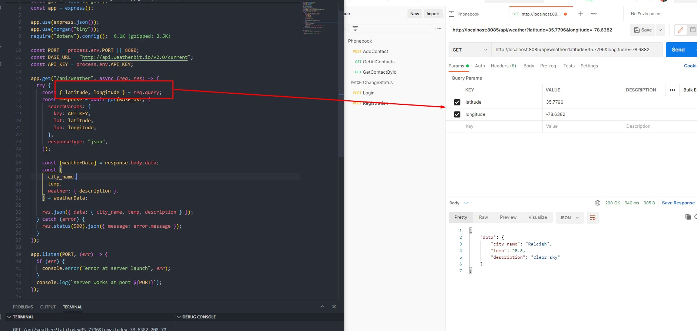

## Переменные окружения

Пароли, ключи и прочие секьюрные данные хранятся в переменных окружения файла `.env`. Для доступа к ним нужно:

1. Установить пакет `npm i dotenv`
2. Перенести данные в `.env`. На текущем этапе он включает:

```
PORT=8083
API_KEY=MY_API_KEY
```

3. В файле, где используются переменные окружения (server.js) заимпортировать `require("dotenv").config()`
4. Теперь PORT и KEY для доступа к API можно прописать так:

```
const PORT = process.env.PORT || 8081;
const KEY = process.env.API_KEY;
```

## Lecture-4

[Ссылка на код](./lectures/lecture_4)

1. Создать файлы `fullRestApi.js` и папку Routers с файлом `postsRouter.js`

Код для `fullRestApi.js`:

```
const express = require("express");
const morgan = require("morgan");
const app = express();

const { postsRouter } = require("./routers/postsRouter");

app.use(express.json());
app.use(morgan("tiny"));
require("dotenv").config();

const PORT = process.env.PORT || 8080;

app.use("/api/posts", postsRouter);

app.listen(PORT, (err) => {
  if (err) {
    console.error("error at server launch", err);
  }
  console.log(`server works at port ${PORT}`);
});

```

для [`postsRouter.js`](#fullRestApi):

```
const express = require("express");
const router = express.Router();
const posts = [
  { id: "1", topic: "test-1", text: "topic text-1" },
  { id: "2", topic: "test-2", text: "topic text-2" },
  { id: "3", topic: "test-3", text: "topic text-3" },
];

router.get("/", (req, res) => {
  res.json({ posts, status: "success" });
});

// *req.params.id
router.get("/:id", (req, res) => {
  const [post] = posts.filter((item) => item.id === req.params.id);
  res.json({ post, status: "success" });
});
router.post("/", (req, res) => {
  const { topic, text } = req.body;
  posts.push({
    id: new Date().getTime().toString(),
    topic,
    text,
  });
  res.json({ status: "success" });
});

router.put("/:id", (req, res) => {
  res.json({ posts: 1 });
});

router.delete("/:id", (req, res) => {
  res.json({ posts: 1 });
});

module.exports = { postsRouter: router };


```

Код для `fullRestApi.js`

```
const express = require("express");
const morgan = require("morgan");
const app = express();

const PORT = process.env.PORT || 8080;
const { postsRouter } = require("./routers/postsRouter");

app.use(express.json());
app.use(morgan("tiny"));
require("dotenv").config();

app.use("/api/posts", postsRouter);

app.listen(PORT, (err) => {
  if (err) {
    console.error("error at server launch", err);
  }
  console.log(`server works at port ${PORT}`);
});
```

# Валидация Joi (npm i joi)

Пример валидации на добавление поста:

```
  const shema = joi.object({
    topic: Joi.string().alphanum().min(3).max(30).required(),
    text: Joi.string().alphanum().min(5).max(300).required(),
  });

  const validationResult = shema.validate(req.body);
  if (validationResult.error) {
    return res.status(400).json({ message: validationResult.error.details });
  }
```

## Refactoring

### Вынос валидации в отдельный файл

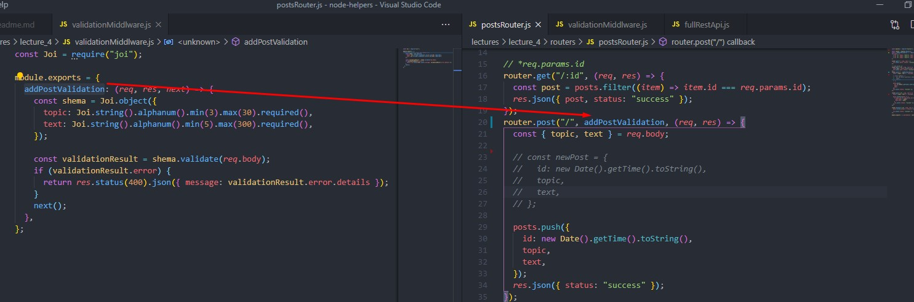

### Вынос логики запросов в отдельный файл

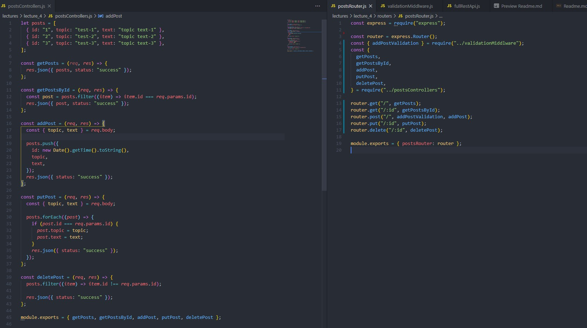

---

### CRUD

Основные операции:

- **GET** - для получения данных. При успешном запросе возвращает представление ресурса в формате JSON или XML и код состояния 200.

- **POST** - используется для отправки сущностей к определенному ресурсу. Создает новый ресурс, т.е. является не идемпотентным. Возвращает код состояния 201. Можно установить заголовок Location с указанием адреса создаваемого ресурса (если ресурс был перемещен)

- **PATCH** - частично обновляет ресурс.
- **PUT** - заменяет объект.
- **DELETE** - удаляет ресурс по _id_.

PUT заменяет ресурс текущим представлением запроса

DELETE удаляет указанный ресурс.

PATCH используется для частичного изменения ресурса

### Работа с базами данных

Виды базы данных:

1. Реляционные (SQL) - хранят данные в таблицах, которые связываются друг с другом. Ячейки информации в таблицах представлены колонками и строками. Нужно строго определять схему.
2. Нереляционные (NoSQL) - данные хранятся в виде иерархических структур с произвольным числом атрибутом. Нет строгих требований к схеме.

## MongoDB

MongoDB - документоориентированная noSQL база данных. Хранит данные в JSON-коллекциях.

### Регистрация

1. **Зарегистрироваться на** [официальном сайте](https://account.mongodb.com/account/register)

2. **Создать базу данных**

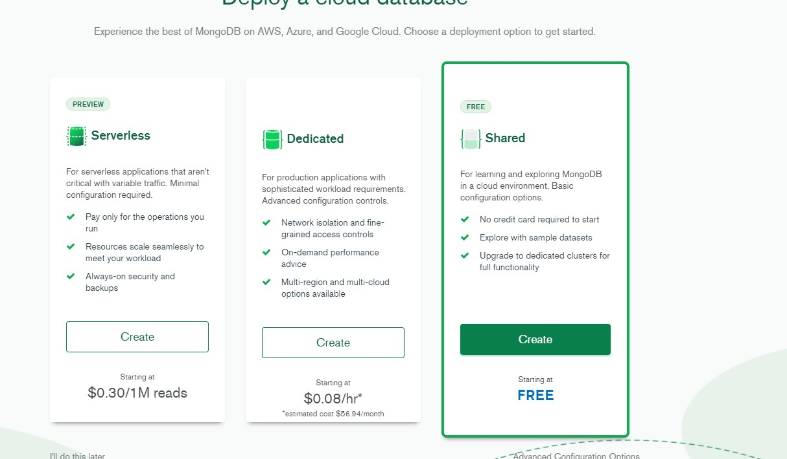

3. **Создать кластер**

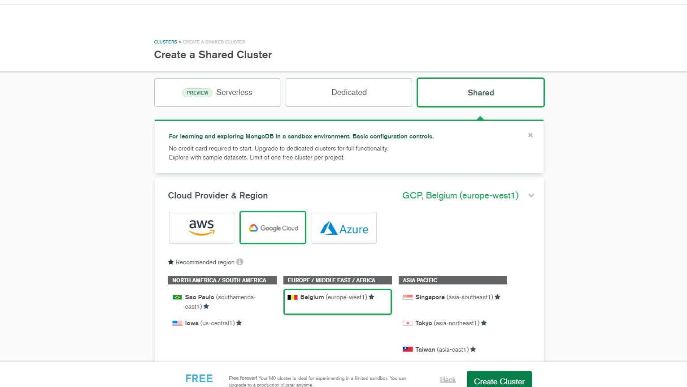

4. **Добавить нового юзера**

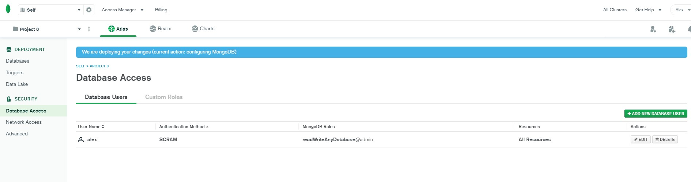

5. **Добавить IP-адрес в разделе Network Access**

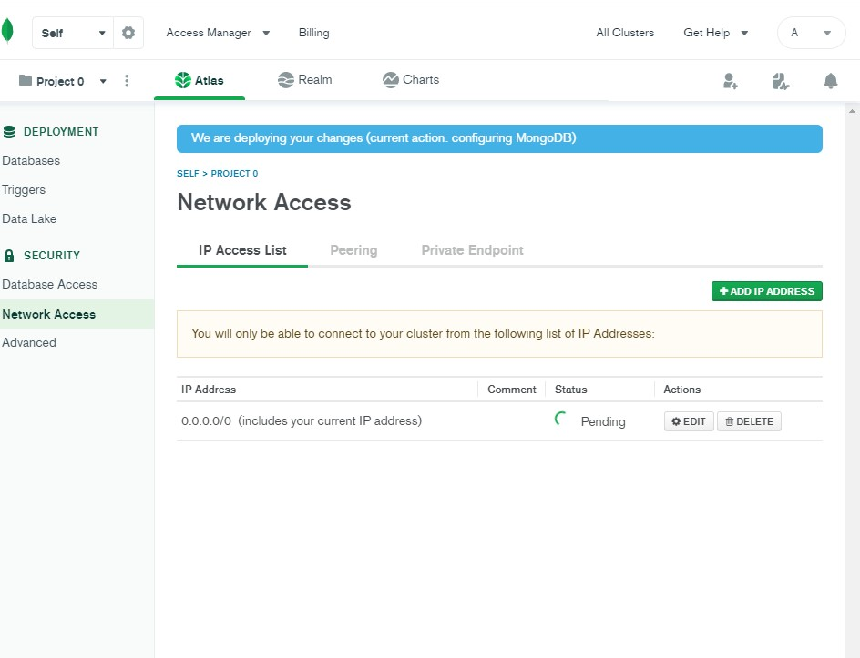

### Подключение к Mongo Compass

1. Установить [Mongo Compass](https://www.mongodb.com/try/download/compass) - графический интерфейс
2. Перейти в раздел DataBase, кликнуть на connect и выбрать MongoDB Compass

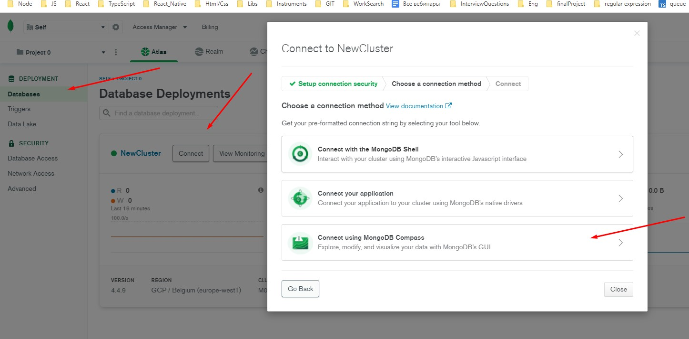

3. Скопировать строку, заменив `<password>` на свой пароль

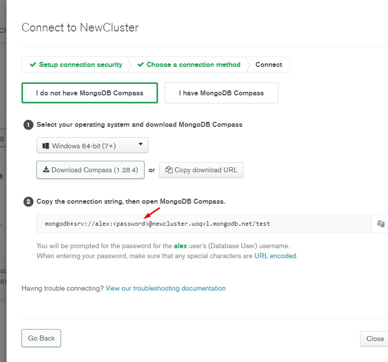

4. Вставить строку в Mongo Atlas и подключиться.

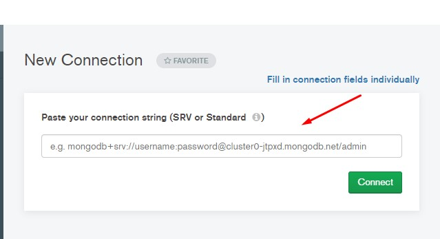

### Работа с Mongo Compass

1. Создать БД и коллекцию (отобразится в интерфейса)

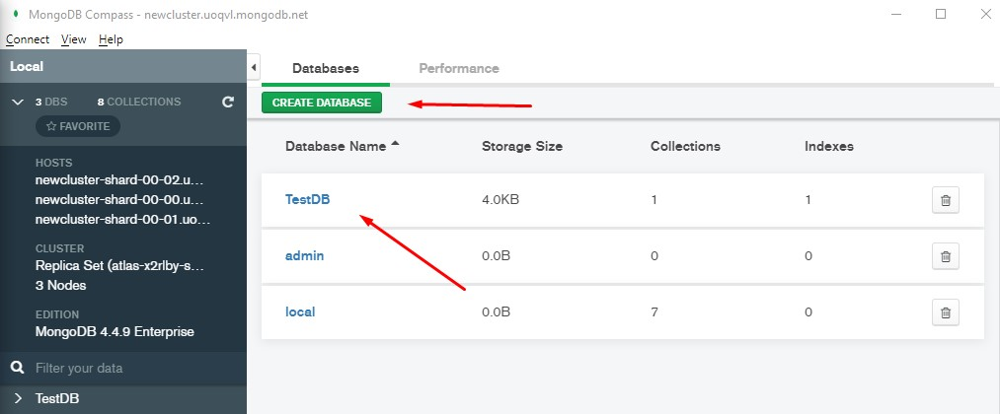

2. Для операций с коллекциями можно использовать графический интерфейс (вверху) или консоль (внизу).

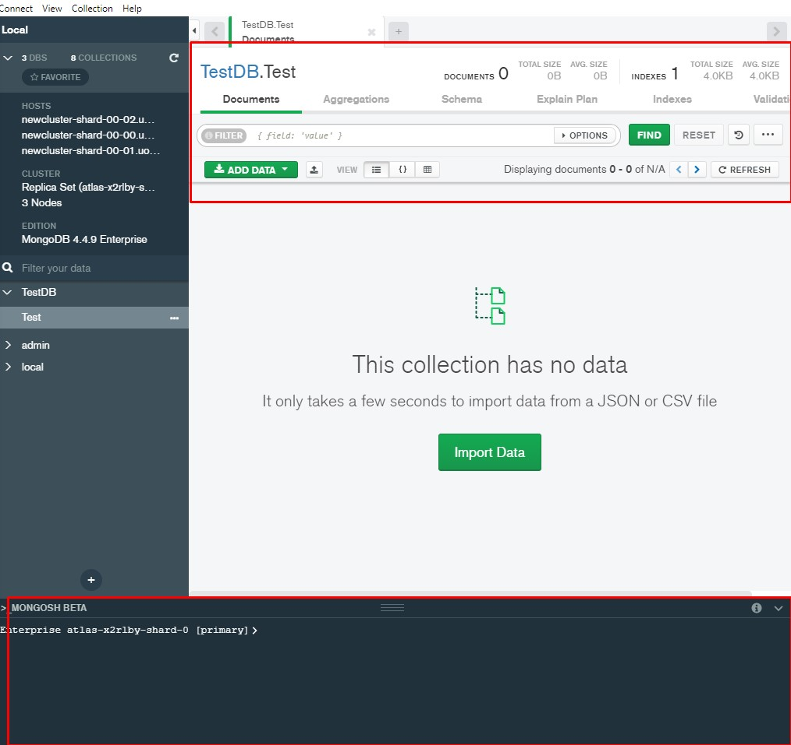

### Основные операции в MongoDB

Далее будем использовать консоль.

- `show dbs` - выведет все БД
- `use <name>` - перейдет на БД с указанным name
- `show collections` - выведет все коллекции БД
- `db.createCollection('nameCollection')` - создаст новую коллекцию
- `db.nameCollection.insert({key:value})` - добавляет новый документ в коллекцию
- `db.nameCollection.find({})` - выведет все документы в коллекции
- `db.nameCollection.findOne({key: value})` - выведет конкретный документ
- `db.nameCollection.updateOne({key:value}, {$set: {key:newValue}})` - обновит конкретное поле (если не указать `$set`, обновит весь документ, а неуказанные поля затрутся)
- `db.nameCollection.remove({key:value})` - удалит документ из коллекции по полю // `deleteOne` - делает то же самое
- `db.nameCollection.deleteOne({_id: ObjectId(<id>)})` - удаление по id

### Подключение к БД в приложении

Первым делом нужно:

1. Установить нативный драйвер mongoDB `npm i mongodb`
2. Сделать импорт в файле с подключением сервера `const mongoClient = require("mongodb").MongoClient;`
3. В Mongo Atlas перейти в `connect > connect your application` и скопировать url-адрес

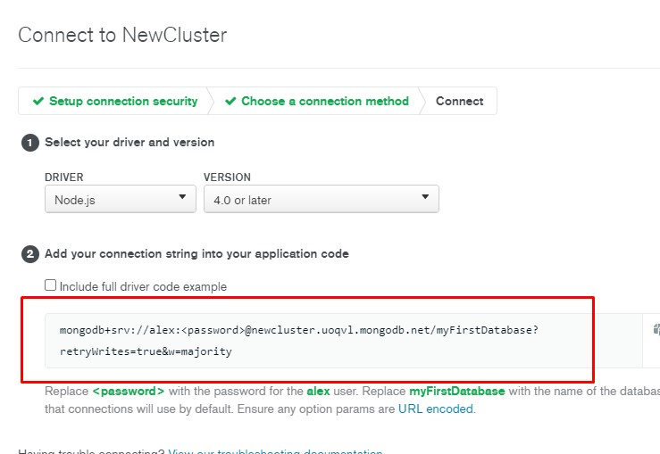

4. Добавить url в .env и заменить `<password>` на свой пароль
5. Указать вместо myFirstDataBase название своей БД

`MONGO_URL=mongodb+srv://alex:<password>@newcluster.uoqvl.mongodb.net/myFirstDatabase?retryWrites=true&w=majority`

Код примера с комментариями:

```
const express = require("express"); //* каркас для построения приложения
const app = express(); //* вызывает функцию из express
const morgan = require("morgan"); //* для логирования запросов
const MongoClient = require("mongodb").MongoClient; //* модуль для подключения к MongoDB
require("dotenv").config(); //* для доступа к переменным окружения в .env

const PORT = process.env.PORT || 8080;

//* Мидлвары
app.use(express.json()); // *мидлвар для парсинга json
app.use(morgan("combined")); //* вызов мидлвар для логирования

//* IIFE для подключения к серверу
(async () => {
  //* настройки подключения
  const client = await MongoClient.connect(process.env.MONGO_URL, {
    useNewUrlParser: true, //* указывает использовать последнюю версию синтаксического анализатора (парсера url-строки)
    useUnifiedTopology: true, //* указывает использовать последнюю версию механизма обнаружения и мониторинга серверов
  });
  const db = client.db(); //* модуль для обращения к коллекциям в БД, db(<здесь>) можно указать имя БД или в .env

  const Users = db.collection("users"); //* создает коллекцию users
  const users = await Users.find({}).toArray(); //* база данных возвращает coursor, нужно преобразовать его в массив
  console.log(users); //* здесь будет коллекция

  //* если не передать порт, сгенерируется случайный
  app.listen(PORT, (err) => {
    if (err) {
      console.error("error at server launch", err);
    }
    console.log(`server works at port ${PORT}`);
  });
})();
```

### Практика

Для обеспечения удобного пользования сразу же позаботимся об архитектуре приложения. Оно будет включать:

- [server.js](./lectures/letcure_5_db/RestFulDb/server.js) для создания сервера через express
- [connection.js](./lectures/letcure_5_db/RestFulDb/connection.js) для подключения к БД
- [controllers.js](./lectures/letcure_5_db/RestFulDb/controllers.js) - для обработки логики запросов
- [routers.js](./lectures/letcure_5_db/RestFulDb/routers.js) - для создания маршрутов на **GET**, **POST** и др. запросы.
- [middlwareModels.js](./lectures/letcure_5_db/RestFulDb/middlewareModels.js) - для получения коллекции из БД во внешнем коде

Функция подключения к БД вызывается в [IIFE](https://developer.mozilla.org/ru/docs/Glossary/IIFE) перед созданием сервера:

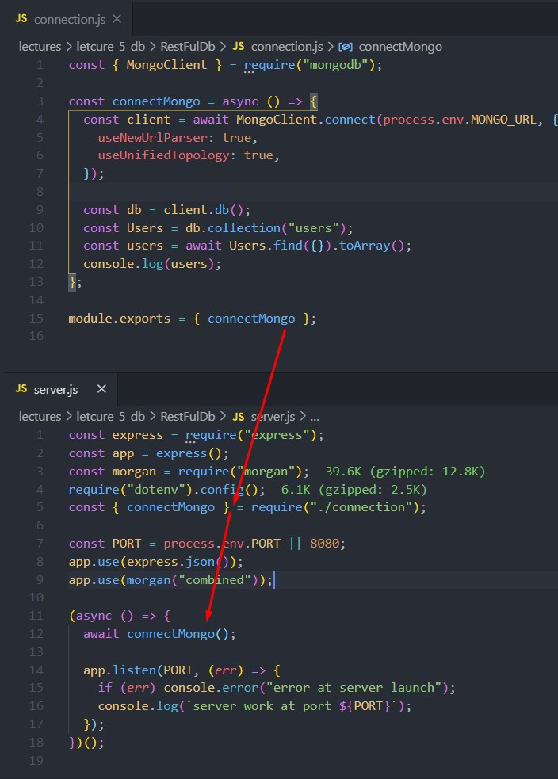

Стоит заострить внимание на том, как организован доступ к коллекции. По порядку о связи между файлами:

- из `connection.js` возвращаются функции `connectMongo` и getCollections
- `connectMongo` вызывается в `server.js` перед запуском сервера
- `getCollections` передается в `middlwareModels.js`, где записывается в переменную.
- из `middlwareModels.js` в `routers.js` передается миддлвар и вызывается для всех маршрутов (`router.use(middlwareModels)`)

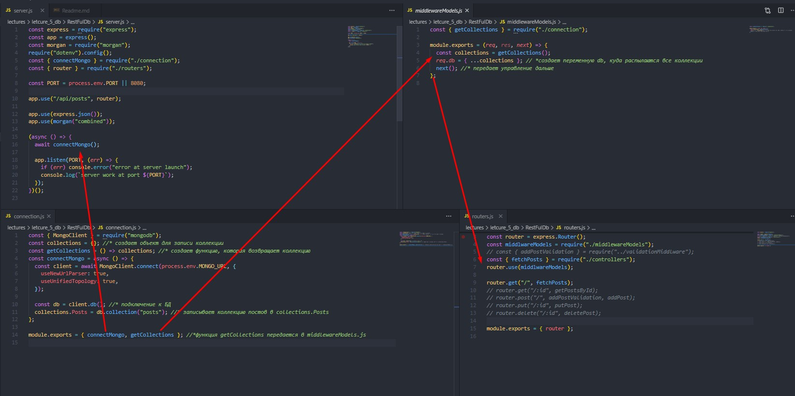

### Написание контроллеров

После записи коллекции через миддлвар она доступна во всем приложении на req.db.Posts Поэтому в [controllers.js](./lectures/letcure_5_db/RestFulDb/controllers.js) можно приступить к написанию операций.

1. **Получение всех постов:**

```
const fetchPosts = async (req, res) => {
  const posts = await req.db.Posts.find({}).toArray();
  res.json({ posts, status: "success" });
};
```

2. **Получение одного поста по id:**

```
// ObjectId понадобится, чтобы преобразовать строку к объекту _id MongoDB
const { ObjectId } = require("mongodb");

const getPostById = async (req, res) => {
  const post = await req.db.Posts.findOne({ _id: new ObjectId(req.params.id) });
  if (!post) {
    return res.status(400).json({
      status: `failure, no posts with id ${id} found`,
    });
  }
  res.json({ post, status: "success" });
};


```

3. **Добавление поста:**

```
const addPost = async (req, res) => {
  const { topic, text } = req.body;
  await req.db.Posts.insertOne({ topic, text });

  res.json({ status: "success" });
};
```

4. **Обновление поста:**

```
const patchPost = async (req, res) => {
  await Posts.updateOne(
    { _id: new ObjectId(req.params.id) },
    { $set: { topic, text } }
  );
  res.json({ status: "success" });
};

```

5.** Удаление поста:**

```
const deletePost = async (req, res) => {
  await req.db.Posts.deleteOne({ _id: new ObjectId(req.params.id) });

  res.json({ status: "success" });
};

```

### Обработка ошибок в контроллерах

Выше прописаны CRUD операции, но в них не обрабатываются ошибки. Можно прописать try/catch для каждого контроллера, но чтобы не дублировать код, лучше написать миддлвар, который будет заниматься отловом ошибок. Для этого в server.js понадобится формат экспрессовского миддлвара с 4-мя параметрами:

```
app.use((error, req, res, next) => {
  res.status(500).json({ message: error.message });
});

```

Также потребуется промежуточное ПО в [routers.js](./lectures/letcure_5_db/RestFulDb/routers.js). Т.к. это ПО не относится к маршрутизации, ее стоит вынести в отдельный файл. Например, [asyncWrapper.js](./lectures/letcure_5_db/RestFulDb/asyncWrapper.js)

```
const asyncWrapper = (controller) => {  // принимает контроллер
   return (req, res, next) => { // возвращает миддлвар, где контроллер принимает req и res
    controller(req, res).catch(next); // в случае ошибки catch отлавливает ее и передает в обработчик ошибок в server.js
  };
};
module.exports = { asyncWrapper };

```

Теперь в [routers.js](./lectures/letcure_5_db/RestFulDb/routers.js) можно обернуть все контроллеры в `asyncWrapper`, и можно не писать `try/catch` для контроллеров:

```
const { asyncWrapper } = require("./asyncWrapper");

router.get("/", asyncWrapper(fetchPosts));
router.get("/:id", asyncWrapper(getPostById));
router.post("/", asyncWrapper(addPostValidation), addPost);
router.patch("/:id", asyncWrapper(patchPost));
router.delete("/:id", asyncWrapper(deletePost));
```

### Подключение к БД через mongoose

Mongoose - это драйвер для MongoDB которые существенно упрощает сообщение с БД и управление коллекциями, а дает возможность создавать определенные схемы. Для работы нужен пакет `npm i mongoose`.

Теперь изменим код для постов так, чтобы использовать ~~не нативный драйвер~~, а `mongoose`.

Архитектура приложения почти такая же, как и при использовании нативного драйвера:

- [server.js](./lectures/lecture_6_db_mongoose/server.js) для создания сервера через express
- [routers.js](./lectures/letcure_5_db/RestFulDb/routers.js) - для создания маршрутов на **GET**, **POST** и др. запросы.
- [controllers.js](./lectures/lecture_6_db_mongoose/controllers.js) - для обработки логики запросов
- [connection.js](./lectures/) для подключения к БД
- [middlwareModels.js](./lectures/letcure_5_db/RestFulDb/middlewareModels.js) - для получения коллекции из БД во внешнем коде
- [connect.js](./lectures/lecture_6_db_mongoose/connect.js) - подключение к БД
- [shema.js](./lectures/lecture_6_db_mongoose/shema.js) - описывает схему коллекции

Почти все модули имеют прежнюю. Файл [middlwareModels.js](./lectures/letcure_5_db/RestFulDb/middlewareModels.js) больше не нужен. И его вызов также нужно убрать из [routers.js](./lectures/letcure_5_db/RestFulDb/routers.js)

~~router.use(middlwareModels);~~

Основные изменения коснулись файлов `connect.js` и `сontrollers.js`. Также добавился файл `shema.js`.

1. Подключение к БД в `connect-js` стало локаничнее. Слева - нативный драйвер; справа - ODB mongoose:

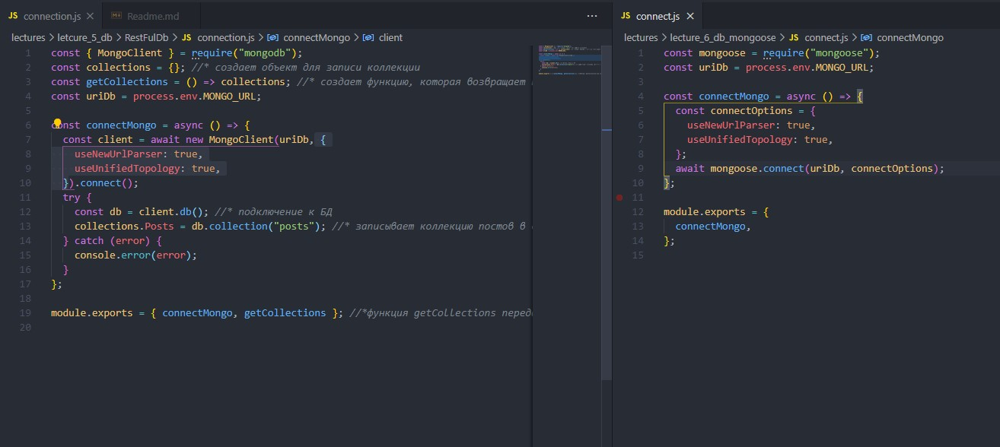

2. После настройки подключения нужно определить схему коллекции в [shema.js](./lectures/lecture_6_db_mongoose/shema.js):

```
const mongoose = require("mongoose");
const { Schema } = mongoose;

const postsShema = new Schema({
  topic: {
    type: String,
    required: true,
  },
  text: {
    type: String,
    required: true,
  },
  createdAt: {
    type: Date,
    default: Date.now(),
    required: true,
  },
});

// * После создания схемы ее нужно скомпилировать в модель
const Post = mongoose.model("Post", postsShema);

module.exports = { Post };
```

[Ссылка на раздел документации по составлению схем](https://mongoosejs.com/docs/guide.html)

3. Теперь можно заимпортировать коллекцию в [controllers.js](./lectures/lecture_6_db_mongoose/controllers.js) и можно использовать ее для операций с коллекцией:

```
const { Post } = require("./shema");

// получение всех постов
const fetchPosts = async (req, res) => {
  const posts = await Posts.find({}); //* преобразовывать в массив не нужно, mongoose сделает это сам
  res.json({ posts, status: "success" });
};

// получение поста по id
const getPostById = async (req, res) => {
  const post = await Post.findById(req.params.id);
  res.json({ post, status: "success" });
};


// добавление поста
const addPost = async (req, res) => {
  const { topic, text } = req.body;

  await Post.create({ topic, text });

  //* аналогичная запись
  //   const post = new Post({ topic, text });
  //     await post.save();
  res.json({ status: "success" });
};

// обновление поста
const patchPost = async (req, res) => {
  const { topic, text } = req.body;
  await Post.findByIdAndUpdate(req.params.id, { $set: { topic, text } });
  res.json({ status: "success" });
};

// удаление поста


```

### Из конспекта

```
В MongoDB в запросах можно использовать условные конструкции с помощью операторов сравнения:

$eq (равно)
$gt (больше чем)
$lt (меньше чем)
$gte (больше или равно)
$lte (меньше или равно)
```
